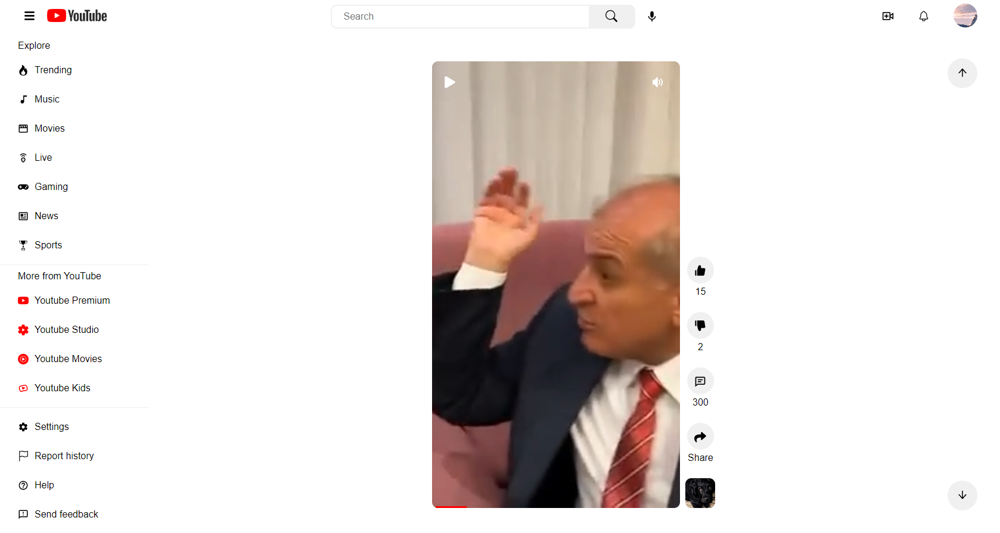
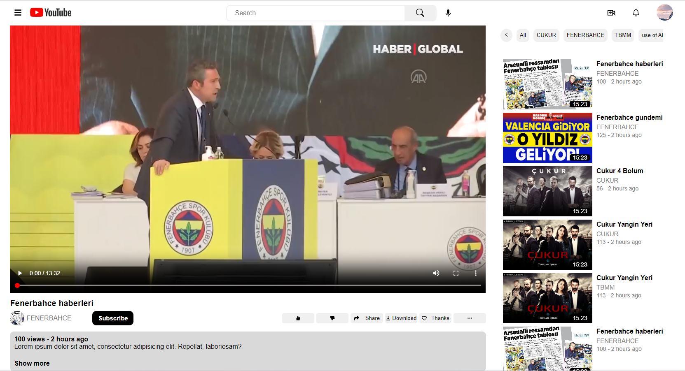

# YouTube-Clone-React-Firebase

>I have developed a YouTube short video clone. I created this project with React and AntDesign. There is only two page:Sign in and Home page. You will sign in Google and Facebook. Home page you will see like as YouTube Short Videos. You can like and dislike video. 

## ## RULES OF USE

> **STEP-1:** `https://github.com/cavidsuleyman/YouTube-ShortSide-ReactJS.git`  
> **STEP-2:**  enter the `YouTube-Clone-React-Firebase` folder that appears  
> **STEP-3:**  open the folder you are in in a text editor  
> **STEP-4:**  open the folder with `cmd` or `Git Bash` and write `npm start`  
> **STEP-5:**  to download the project as `.zip`  [here](https://github.com/cavidsuleyman/YouTube-ShortSide-ReactJS/archive/refs/heads/master.zip) click  

## Technology

This project was developed using the following technologies

| No | Technique | Purpose |
| - | ---------- | --------------------- |
| 1 | React | Create this system |
| 2 | Firebase | Create Sign in and Sign up system |
| 3 | VSCode | Text editor used in the project |
| 4 | AntDesign | React UI library |

## SAMPLE SCREEN APPEARANCE

>It is Sign in page:

>It is home page:

